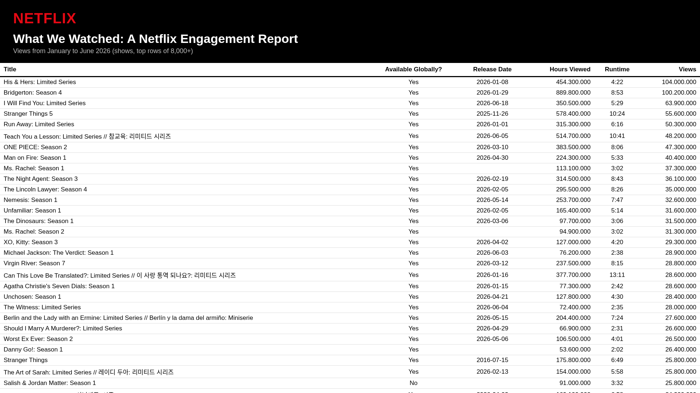
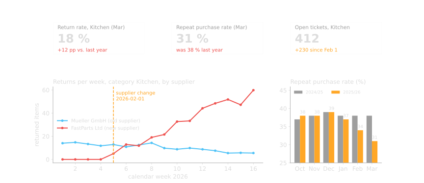

<!-- ### Historical example

- https://en.wikipedia.org/wiki/Jim_Simons

--- -->

### Example Netflix

--

#### Your turn first (groups of 2-3, 15 min)

You run Netflix. Next year you have 100 million &euro; for new content.

What do you need to know to decide what to produce?

- write down <b>3 questions</b> you would want answered
- for each: <b>which data</b> would answer it, and <b>where</b> would it come from?
- then 3 min per group at the whiteboard WHITEBOARD

Note:

- No data on purpose. The students start from the business decision, not from a table.
- While they work: walk around, push vague questions ("what is popular?") towards decidable ones ("which genre keeps new subscribers past month one?").
- At the whiteboard: cluster the questions into content, audience, timing, money. Keep the board, it is reused two slides later.
- Guiding questions for the discussion: Which questions came up in every group? Which need data Netflix probably does not have? Who in the company would act on the answer?

--

This is what Netflix publishes. Which of your questions does this table answer? Which not?

Note:

- 8,000+ shows and 8,000+ movies, views and hours for every title, January to June 2026. Netflix has published this twice a year since 2023, from 2027 only once a year.
- Typical questions and whether this table answers them:
  1. Which types of content drive engagement? Partly: there is no genre column, you would have to add it from another source.
  2. Return on content investment? No: no production costs or licensing fees in here.
  3. Best release timing? Partly: release date is there, seasonality needs several reports.
  4. Does runtime matter? Yes: runtime, hours viewed and views allow a first look at completion.
  5. Weekday vs. weekend release? Partly, release date only.
  6. Which content brings new subscribers? No: no subscriber data at all.
- Point to make: a published table answers almost none of the business questions completely. Internally Netflix has data per user, per session, per second. The questions decide which data is worth collecting, not the other way round.

--

- What are business relevant questions for Netflix?
- What (data) do we need to answer those questions?
- Where do we get this information from?
- Who needs access to this information?

WHITEBOARD fill the four from the board

Note: Fill these four from the whiteboard. These four questions are the whole course on one slide.

--

That is BI!

--

#### Same game, your field: the emergency department

You run the emergency department of a hospital. Winter is coming.

What do you need to know to plan beds and staff for the next three months?

- 5 min, same groups, 3 questions
- then: where does this data live today? WHITEBOARD

Note:

- Expected questions: how many patients per hour, weekday and season; how long do they stay; which cases (flu, falls, cardiac); how many are admitted to a ward; how many staff per shift; when do waves (flu, heat) come.
- Where the data lives: hospital information system (admissions, triage, diagnoses), staff rosters, bed management; outside: RKI influenza surveillance, weather forecast, school holidays.
- Same structure as Netflix: decision, questions, data, sources, who acts on it. The module description calls this eHealth. It is BI with patients instead of viewers.
- Optional: this is the OODA loop that comes later in the deck.

--

[source: Netflix, What We Watched, first half of 2026](https://about.netflix.com/en/news/what-we-watched-the-first-half-of-2026)

<small>full table as Excel in the course repo: <code>data/netflix_what_we_watched_2026H1.xlsx</code></small>

---

### BI for dummies

<svg viewBox="0 0 1920 1080" style="width: 100%; max-height: 540px; background: transparent" font-family="Helvetica, Arial, sans-serif" fill="#fff" text-anchor="middle" font-size="86">
  <rect x="90" y="760" width="1740" height="220" fill="#4ea8f5"/>
  <text x="960" y="900">Business relevant questions</text>
  <polygon points="960,672 1030,722 985,722 985,748 935,748 935,722 890,722" fill="#9e9e9e"/>
  <rect x="90" y="440" width="1740" height="220" fill="#f0b03f"/>
  <text x="960" y="580">Data</text>
  <polygon points="960,352 1030,402 985,402 985,428 935,428 935,402 890,402" fill="#9e9e9e"/>
  <rect x="90" y="120" width="1740" height="220" fill="#7ed957"/>
  <text x="960" y="260">Informed (data driven) decisions</text>
</svg>

Note:

- Read bottom-up: start with the questions the business needs answered (Netflix slide), then collect the data to answer them, then decide.
- Without the question, data is just storage cost. Without the decision, BI is just reporting.

---

### Important BI Goals & Benefits

<!-- ===== VARIANT A: sorting exercise + four goals (2 slides) ===== -->

--

Your whiteboard questions: which of these goals does each one serve? WHITEBOARD

Note:

- 5 minutes, call out from the room. Take each question from the Netflix and emergency department boards and let the room assign it to one icon.
- Expect that almost everything lands on four icons: decision-making, revenue, efficiency, visibility. Say that out loud, it is the point of the next slide.
- Two icons will get nothing: security & compliance and data-driven culture. Ask why. Answer: they are not goals, they are conditions.

--

### Four goals, everything else is a flavour

  

    
Decide better

    
decision-making, forecasting, what-if

    
Netflix: which content to fund next year

  

  

    
Earn more

    
revenue, customer experience, competitive advantage

    
Netflix: which titles keep new subscribers past month one

  

  

    
Run cheaper

    
operational efficiency

    
Emergency department: staff per shift follows the hourly patient curve

  

  

    
Know what is going on

    
visibility, accountability

    
Emergency department: waiting time today vs. last week, on one screen

  

  Security &amp; compliance and a data-driven culture are not goals. They are conditions. They come back under "pitfalls".

Note:

- One sentence per goal, then the example. Do not read the grey sub-lines, they only map the ten icons from the previous slide onto the four.
- Ask: which of the four would your employer pay for first? Usually "run cheaper" or "earn more". That is where BI budgets come from.

<!-- ===== VARIANT B (not used, kept for reference): ten goals as one table.
     To reactivate: move this block out of the comment and add a '--' separator above it,
     then rename 'Notes B:' back to 'Note:'. =====

Variant B

### Ten goals of BI, one example each

<table style="width: 100%; font-size: 0.42em; border-collapse: collapse; text-align: left; margin-top: 0.3em">
<tr style="color: #9e9e9e"><th style="padding: 0.25em 0.6em; border-bottom: 2px solid rgba(255,255,255,0.3)">goal</th><th style="padding: 0.25em 0.6em; border-bottom: 2px solid rgba(255,255,255,0.3)">what it means</th><th style="padding: 0.25em 0.6em; border-bottom: 2px solid rgba(255,255,255,0.3)">from our two examples</th></tr>
<tr style="color: #eee"><td style="padding: 0.25em 0.6em; border-bottom: 1px solid rgba(255,255,255,0.14); white-space: nowrap; color: #f0b03f">Decision-making</td><td style="padding: 0.25em 0.6em; border-bottom: 1px solid rgba(255,255,255,0.14)">put the right numbers in front of the person who decides</td><td style="padding: 0.25em 0.6em; border-bottom: 1px solid rgba(255,255,255,0.14)">Netflix: which genres to fund next year</td></tr>
<tr style="color: #eee"><td style="padding: 0.25em 0.6em; border-bottom: 1px solid rgba(255,255,255,0.14); white-space: nowrap; color: #f0b03f">Forecasting &amp; planning</td><td style="padding: 0.25em 0.6em; border-bottom: 1px solid rgba(255,255,255,0.14)">use the past to plan the next months</td><td style="padding: 0.25em 0.6em; border-bottom: 1px solid rgba(255,255,255,0.14)">ED: expected patients per shift in January</td></tr>
<tr style="color: #eee"><td style="padding: 0.25em 0.6em; border-bottom: 1px solid rgba(255,255,255,0.14); white-space: nowrap; color: #f0b03f">Revenue growth</td><td style="padding: 0.25em 0.6em; border-bottom: 1px solid rgba(255,255,255,0.14)">find where the money is</td><td style="padding: 0.25em 0.6em; border-bottom: 1px solid rgba(255,255,255,0.14)">Netflix: which titles keep subscribers past month one</td></tr>
<tr style="color: #eee"><td style="padding: 0.25em 0.6em; border-bottom: 1px solid rgba(255,255,255,0.14); white-space: nowrap; color: #f0b03f">Customer experience</td><td style="padding: 0.25em 0.6em; border-bottom: 1px solid rgba(255,255,255,0.14)">know your users as groups, not as an average</td><td style="padding: 0.25em 0.6em; border-bottom: 1px solid rgba(255,255,255,0.14)">Netflix: viewing habits per segment, not per &quot;average viewer&quot;</td></tr>
<tr style="color: #eee"><td style="padding: 0.25em 0.6em; border-bottom: 1px solid rgba(255,255,255,0.14); white-space: nowrap; color: #f0b03f">Competitive advantage</td><td style="padding: 0.25em 0.6em; border-bottom: 1px solid rgba(255,255,255,0.14)">spot a trend before the others do</td><td style="padding: 0.25em 0.6em; border-bottom: 1px solid rgba(255,255,255,0.14)">Netflix: Korean thrillers break out, buy more of them</td></tr>
<tr style="color: #eee"><td style="padding: 0.25em 0.6em; border-bottom: 1px solid rgba(255,255,255,0.14); white-space: nowrap; color: #f0b03f">Operational efficiency</td><td style="padding: 0.25em 0.6em; border-bottom: 1px solid rgba(255,255,255,0.14)">do the same work with less waste</td><td style="padding: 0.25em 0.6em; border-bottom: 1px solid rgba(255,255,255,0.14)">ED: staff rostered to the hourly patient curve</td></tr>
<tr style="color: #eee"><td style="padding: 0.25em 0.6em; border-bottom: 1px solid rgba(255,255,255,0.14); white-space: nowrap; color: #f0b03f">Visibility</td><td style="padding: 0.25em 0.6em; border-bottom: 1px solid rgba(255,255,255,0.14)">everyone looks at the same, current picture</td><td style="padding: 0.25em 0.6em; border-bottom: 1px solid rgba(255,255,255,0.14)">ED: waiting time now vs. last week, on one screen</td></tr>
<tr style="color: #eee"><td style="padding: 0.25em 0.6em; border-bottom: 1px solid rgba(255,255,255,0.14); white-space: nowrap; color: #f0b03f">Accountability</td><td style="padding: 0.25em 0.6em; border-bottom: 1px solid rgba(255,255,255,0.14)">link results to actions and people</td><td style="padding: 0.25em 0.6em; border-bottom: 1px solid rgba(255,255,255,0.14)">ED: did the new triage process shorten waits?</td></tr>
<tr style="color: #9e9e9e"><td style="padding: 0.25em 0.6em; border-bottom: 1px solid rgba(255,255,255,0.14); white-space: nowrap; color: #9e9e9e">Data-driven culture</td><td style="padding: 0.25em 0.6em; border-bottom: 1px solid rgba(255,255,255,0.14)">people reach for data before opinion (a condition, not a goal)</td><td style="padding: 0.25em 0.6em; border-bottom: 1px solid rgba(255,255,255,0.14)">both: &quot;what does the data say?&quot; becomes a habit</td></tr>
<tr style="color: #9e9e9e"><td style="padding: 0.25em 0.6em; border-bottom: 1px solid rgba(255,255,255,0.14); white-space: nowrap; color: #9e9e9e">Security &amp; compliance</td><td style="padding: 0.25em 0.6em; border-bottom: 1px solid rgba(255,255,255,0.14)">who may see what, and prove it (a condition, not a goal)</td><td style="padding: 0.25em 0.6em; border-bottom: 1px solid rgba(255,255,255,0.14)">ED: patient data, GDPR, access logs</td></tr>
</table>

Notes B:

- Walk the table top to bottom in two minutes, one example per row, do not explain the middle column.
- The last two rows are grey on purpose: they are conditions for BI, not what a company buys BI for.
-->

---

### BI Components

<svg viewBox="0 0 1920 1080" style="width: 100%; max-height: 540px; background: transparent" font-family="Helvetica, Arial, sans-serif" fill="#fff" text-anchor="middle" font-size="56">
  <defs><linearGradient id="valeff" x1="0" y1="0" x2="0" y2="1"><stop offset="0" stop-color="#7ed957"/><stop offset="1" stop-color="#e5412e"/></linearGradient></defs>
  <rect x="60" y="213" width="140" height="654" fill="url(#valeff)"/>
  <text x="130" y="530" font-size="38" font-weight="bold">Value</text>
  <text x="130" y="572" font-size="38" font-weight="bold">Effort</text>
  <rect x="355" y="213" width="1145" height="120" fill="#5f5f5f"/>
  <text x="928" y="291" font-size="56">Decisions</text>
  <rect x="355" y="347" width="1145" height="120" fill="#8e8e8e"/>
  <text x="928" y="425" font-size="56">Reporting (Visualisation)</text>
  <rect x="355" y="481" width="1145" height="120" fill="#5f5f5f"/>
  <text x="928" y="559" font-size="56">Data Analysis &amp; Exploration</text>
  <rect x="230" y="615" width="1270" height="120" fill="#8e8e8e"/>
  <text x="865" y="693" font-size="56">Data Warehousing / Data Marts</text>
  <rect x="230" y="749" width="1270" height="120" fill="#5f5f5f"/>
  <text x="865" y="827" font-size="48">Raw Data (self produced or foreign sources)</text>
  <rect x="230" y="213" width="110" height="387" fill="#5f5f5f"/>
  <text x="285" y="426">AI</text>
  <path d="M1500,807 H1550 V673 H1517" fill="none" stroke="#c8c8c8" stroke-width="6"/>
  <polygon points="1503,673 1527,658 1527,688" fill="#c8c8c8"/>
  <text x="1560" y="720" font-size="42" fill="#c8c8c8" text-anchor="start">Data Integration</text>
  <text x="1560" y="765" font-size="42" fill="#c8c8c8" text-anchor="start">ETL / ELT</text>
</svg>

Note:

- Classic picture: AI sits on top of the stack and consumes what the lower layers deliver (analysis, reporting, decisions).

--

### BI Components (2026)

<svg viewBox="0 0 1920 1080" style="width: 100%; max-height: 540px; background: transparent" font-family="Helvetica, Arial, sans-serif" fill="#fff" text-anchor="middle" font-size="56">
  <defs><linearGradient id="valeff" x1="0" y1="0" x2="0" y2="1"><stop offset="0" stop-color="#7ed957"/><stop offset="1" stop-color="#e5412e"/></linearGradient></defs>
  <rect x="60" y="213" width="140" height="654" fill="url(#valeff)"/>
  <text x="130" y="530" font-size="38" font-weight="bold">Value</text>
  <text x="130" y="572" font-size="38" font-weight="bold">Effort</text>
  <rect x="355" y="213" width="1145" height="120" fill="#5f5f5f"/>
  <text x="928" y="291" font-size="56">Decisions</text>
  <rect x="355" y="347" width="1145" height="120" fill="#8e8e8e"/>
  <text x="928" y="425" font-size="56">Reporting (Visualisation)</text>
  <rect x="355" y="481" width="1145" height="120" fill="#5f5f5f"/>
  <text x="928" y="559" font-size="56">Data Analysis &amp; Exploration</text>
  <rect x="355" y="615" width="1145" height="120" fill="#8e8e8e"/>
  <text x="928" y="693" font-size="56">Data Warehousing / Data Marts</text>
  <rect x="355" y="749" width="1145" height="120" fill="#5f5f5f"/>
  <text x="928" y="827" font-size="48">Raw Data (self produced or foreign sources)</text>
  <rect x="230" y="213" width="110" height="654" fill="#5f5f5f"/>
  <text x="285" y="560">AI</text>
  <path d="M1500,807 H1550 V673 H1517" fill="none" stroke="#c8c8c8" stroke-width="6"/>
  <polygon points="1503,673 1527,658 1527,688" fill="#c8c8c8"/>
  <text x="1560" y="720" font-size="42" fill="#c8c8c8" text-anchor="start">Data Integration</text>
  <text x="1560" y="765" font-size="42" fill="#c8c8c8" text-anchor="start">ETL / ELT</text>
  <text x="960" y="980" font-size="44" fill="#c8c8c8">AI is no longer only on top: it is used to build and run every layer</text>
</svg>

Note:

- Same stack, but AI is now a tool for implementing the lower layers too: generating ETL code, writing SQL, cleaning data, building dashboards.
- Discussion: which of these roles (next slide) change the most because of that?

---

### One case, bottom-up

Case Study

An online retailer observes a deterioration in sales.
An initial assumption: customer loyalty has declined.

Is that true, and what should the retailer do? Let's walk through the stack from the bottom.

  
To make it concrete, we follow one customer through every layer

  <pre style="margin: 0; width: 100%; box-shadow: none; font-size: 0.33em; line-height: 1.35; background: transparent; padding: 0.2em 0"><code class="nohighlight" style="background: transparent; padding: 0; white-space: pre-wrap">Anna M., customer 4711, loyal customer since 2024.
On 2026-03-14 she orders a coffee grinder (KG-X200, 89.90 EUR). It arrives broken. She opens a ticket and returns it.
The grinder comes from a new supplier (FastParts Ltd) since 2026-02-01.</code></pre>

Note:

- Same stack as before, but now with one concrete case and one concrete customer. Each layer gets one slide: what exists there, what we do with it, and what Anna's data looks like at that point.
- Ask the room first: what data does an online shop even have?

--

### 1. Raw Data

  

<svg viewBox="200 190 1700 700" style="width: 100%; background: transparent" font-family="Helvetica, Arial, sans-serif" fill="#fff" text-anchor="middle" font-size="56">
  <rect x="355" y="213" width="1145" height="120" fill="#5f5f5f"/>
  <text x="928" y="291" font-size="56">Decisions</text>
  <rect x="355" y="347" width="1145" height="120" fill="#8e8e8e"/>
  <text x="928" y="425" font-size="56">Reporting (Visualisation)</text>
  <rect x="355" y="481" width="1145" height="120" fill="#5f5f5f"/>
  <text x="928" y="559" font-size="56">Data Analysis &amp; Exploration</text>
  <rect x="355" y="615" width="1145" height="120" fill="#8e8e8e"/>
  <text x="928" y="693" font-size="56">Data Warehousing / Data Marts</text>
  <rect x="355" y="749" width="1145" height="120" fill="#f0b03f"/>
  <text x="928" y="827" font-size="48">Raw Data (self produced or foreign sources)</text>
  <rect x="230" y="213" width="110" height="654" fill="#5f5f5f"/>
  <text x="285" y="560">AI</text>
  <path d="M1500,807 H1550 V673 H1517" fill="none" stroke="#c8c8c8" stroke-width="6"/>
  <polygon points="1503,673 1527,658 1527,688" fill="#c8c8c8"/>
  <text x="1560" y="720" font-size="42" fill="#c8c8c8" text-anchor="start">Data Integration</text>
  <text x="1560" y="765" font-size="42" fill="#c8c8c8" text-anchor="start">ETL / ELT</text>
</svg>
  

  

    <ul>
      <li>Shop database: orders, customers, products, returns</li>
      <li>Web tracking: sessions, clicks, abandoned baskets</li>
      <li>Customer service: tickets, complaints, reviews</li>
      <li>Marketing / external: campaigns, ad spend, competitor prices, holidays</li>
      <li>Scattered over many systems, different formats, nobody has the full picture</li>
    </ul>
  

  
Anna in the raw data: 5 systems, 3 IDs, 3 date formats

  <pre style="margin: 0; width: 100%; box-shadow: none; font-size: 0.33em; line-height: 1.35; background: transparent; padding: 0.2em 0"><code class="nohighlight" style="background: transparent; padding: 0; white-space: pre">shop db  orders    90817 | customer 4711 | KG-X200 | 89.90 | 2026-03-14
shop db  returns   90817 | "broken on arrival" | 20.03.2026
tracking (json)    {"uid":"a7f3c1","event":"view","url":"/kitchen/kg-x200","ts":"2026-03-14T19:02:11Z"}
tickets.csv        T-5582;14/03/26;anna.m@example.com;"grinder arrived broken, second time!"
products (erp)     KG-X200 | Kitchen | supplier FastParts Ltd since 2026-02-01 (was Mueller GmbH)</code></pre>

Note:

- Point: the data to answer the question already exists, but in five systems with five owners. Anna is 4711 in the shop, a7f3c1 in the tracking, and an email address in the ticket system. The first BI job is to get it into one place and agree that these are the same person.

--

### 2. Data Integration &amp; Warehousing

  

<svg viewBox="200 190 1700 700" style="width: 100%; background: transparent" font-family="Helvetica, Arial, sans-serif" fill="#fff" text-anchor="middle" font-size="56">
  <rect x="355" y="213" width="1145" height="120" fill="#5f5f5f"/>
  <text x="928" y="291" font-size="56">Decisions</text>
  <rect x="355" y="347" width="1145" height="120" fill="#8e8e8e"/>
  <text x="928" y="425" font-size="56">Reporting (Visualisation)</text>
  <rect x="355" y="481" width="1145" height="120" fill="#5f5f5f"/>
  <text x="928" y="559" font-size="56">Data Analysis &amp; Exploration</text>
  <rect x="355" y="615" width="1145" height="120" fill="#f0b03f"/>
  <text x="928" y="693" font-size="56">Data Warehousing / Data Marts</text>
  <rect x="355" y="749" width="1145" height="120" fill="#5f5f5f"/>
  <text x="928" y="827" font-size="48">Raw Data (self produced or foreign sources)</text>
  <rect x="230" y="213" width="110" height="654" fill="#5f5f5f"/>
  <text x="285" y="560">AI</text>
  <path d="M1500,807 H1550 V673 H1517" fill="none" stroke="#f0b03f" stroke-width="6"/>
  <polygon points="1503,673 1527,658 1527,688" fill="#f0b03f"/>
  <text x="1560" y="720" font-size="42" fill="#f0b03f" text-anchor="start">Data Integration</text>
  <text x="1560" y="765" font-size="42" fill="#f0b03f" text-anchor="start">ETL / ELT</text>
</svg>
  

  

    <ul>
      <li>Extract / Load: copy all sources into one warehouse, every night (or in real time)</li>
      <li>Transform: one customer ID across systems, one date format, one currency, deduplicate</li>
      <li>Define the metrics once: what exactly is a "repeat customer"? "revenue" with or without returns?</li>
      <li>Data marts: sales mart and customer mart, one row per customer and month</li>
    </ul>
  

  
Anna after ETL: one ID, ISO dates, one row per fact, one row per customer and month

  <pre style="margin: 0; width: 100%; box-shadow: none; font-size: 0.33em; line-height: 1.35; background: transparent; padding: 0.2em 0"><code class="nohighlight" style="background: transparent; padding: 0; white-space: pre">dim_customer    4711 | anna.m@example.com | uid a7f3c1 | first_order 2024-05-02 | segment: loyal
dim_product     KG-X200 | Kitchen | supplier FastParts Ltd | valid_from 2026-02-01
fact_orders     90817 | 4711 | KG-X200 | 2026-03-14 | 89.90 | returned: yes | ticket: T-5582
customer_month  4711 | 2026-03 | orders 1 | revenue 89.90 | returns 1 | tickets 1 | repeat_customer: yes</code></pre>

Note:

- This is module III and IV (databases, ETL). Show how the three IDs collapse into 4711 and the three date formats into ISO. Stress the metric definitions: most BI fights are about definitions, not numbers.

--

### 3. Data Analysis &amp; Exploration

  

<svg viewBox="200 190 1700 700" style="width: 100%; background: transparent" font-family="Helvetica, Arial, sans-serif" fill="#fff" text-anchor="middle" font-size="56">
  <rect x="355" y="213" width="1145" height="120" fill="#5f5f5f"/>
  <text x="928" y="291" font-size="56">Decisions</text>
  <rect x="355" y="347" width="1145" height="120" fill="#8e8e8e"/>
  <text x="928" y="425" font-size="56">Reporting (Visualisation)</text>
  <rect x="355" y="481" width="1145" height="120" fill="#f0b03f"/>
  <text x="928" y="559" font-size="56">Data Analysis &amp; Exploration</text>
  <rect x="355" y="615" width="1145" height="120" fill="#8e8e8e"/>
  <text x="928" y="693" font-size="56">Data Warehousing / Data Marts</text>
  <rect x="355" y="749" width="1145" height="120" fill="#5f5f5f"/>
  <text x="928" y="827" font-size="48">Raw Data (self produced or foreign sources)</text>
  <rect x="230" y="213" width="110" height="654" fill="#5f5f5f"/>
  <text x="285" y="560">AI</text>
  <path d="M1500,807 H1550 V673 H1517" fill="none" stroke="#c8c8c8" stroke-width="6"/>
  <polygon points="1503,673 1527,658 1527,688" fill="#c8c8c8"/>
  <text x="1560" y="720" font-size="42" fill="#c8c8c8" text-anchor="start">Data Integration</text>
  <text x="1560" y="765" font-size="42" fill="#c8c8c8" text-anchor="start">ETL / ELT</text>
</svg>
  

  

    <ul>
      <li>Now we can actually ask the question. Four stages, increasing in value and difficulty:</li>
      <li>Descriptive: what happened? Diagnostic: why?</li>
      <li>Predictive: what will happen? Prescriptive: what should we do?</li>
      <li>Descriptive and diagnostic: classic BI. Predictive and prescriptive: statistics and AI, the second half of this course</li>
    </ul>
  

  
Anna's row becomes one of thousands: aggregate first, then ask the four questions (next slides)

  <pre style="margin: 0; width: 100%; box-shadow: none; font-size: 0.33em; line-height: 1.35; background: transparent; padding: 0.2em 0"><code class="nohighlight" style="background: transparent; padding: 0; white-space: pre">customer_month  4711 | 2026-03 | orders 1 | revenue 89.90 | returns 1 | tickets 1      (one of 23,480 rows)
                                     | SUM / COUNT ... GROUP BY category, month
kitchen_month   2026-03 | orders 6,210 | returns 1,118 | return rate 18% | repeat purchase rate 31%</code></pre>

Note:

- The next slides go through the four stages in detail with the same case. The last two stages are the bridge to A/B testing (module V) and AI (VI). Note that Anna disappears into an aggregate here and reappears as one row of the list in the prescriptive step.

--

--

Descriptive Analytics

What data or metrics would you examine to understand the current state of customer loyalty and sales?

- historical sales data, customer repeat purchase rates, average order value, and site traffic trends
- key metrics such as monthly active users, average purchase frequency, and customer satisfaction ratings

  
Our case

  <pre style="margin: 0; width: 100%; box-shadow: none; font-size: 0.33em; line-height: 1.35; background: transparent; padding: 0.2em 0"><code class="nohighlight" style="background: transparent; padding: 0; white-space: pre">Kitchen, 2026-03: return rate 18% (2025-03: 6%), repeat purchase rate 31% (was 38%)
-&gt; something is wrong, and it is bigger than normal fluctuation</code></pre>

--

Diagnostic Analytics

Why might customer loyalty and sales be declining? What factors could be causing this trend?

- Investigate possible issues such as product availability, customer feedback (e.g., complaints, reviews), competitive factors, or recent changes in pricing or service.
- Check if there’s been an increase in customer support tickets, returns, or complaints about a specific product category or aspect of service.

  
Our case

  <pre style="margin: 0; width: 100%; box-shadow: none; font-size: 0.33em; line-height: 1.35; background: transparent; padding: 0.2em 0"><code class="nohighlight" style="background: transparent; padding: 0; white-space: pre">GROUP BY supplier:  FastParts 21% returns  |  Mueller 5%
-&gt; started exactly with the supplier change on 2026-02-01; tickets say "broken on arrival"</code></pre>

--

Predictive Analytics

Based on the data, what can we predict about future sales or customer loyalty if current trends continue?

- Forecast future sales using time series models and analyze if there’s a trend indicating further decline or possible recovery.
- Examine customer cohorts to predict repeat purchase behavior, or use demographic data to anticipate seasonal trends in customer loyalty.

  
Our case

  <pre style="margin: 0; width: 100%; box-shadow: none; font-size: 0.33em; line-height: 1.35; background: transparent; padding: 0.2em 0"><code class="nohighlight" style="background: transparent; padding: 0; white-space: pre">p(buys again | "broken" ticket) = 0.12   vs.   0.38 for everyone else
-&gt; 4,000 affected customers, about 350k EUR revenue at risk over the next 12 months</code></pre>

--

Prescriptive Analytics

What strategies or actions could the retailer take to improve customer loyalty and boost sales?

- Recommend targeted loyalty programs, personalized offers, or new product lines to increase engagement.
- Consider adjustments in marketing strategies, pricing, customer service improvements, or implementing a feedback loop for continual improvement.

  
Our case

  <pre style="margin: 0; width: 100%; box-shadow: none; font-size: 0.33em; line-height: 1.35; background: transparent; padding: 0.2em 0"><code class="nohighlight" style="background: transparent; padding: 0; white-space: pre">fix or replace the supplier  +  win-back offer for the 4,000   (4711 Anna is on that list)
-&gt; and measure whether the offer works: A/B test (module V)</code></pre>

--

### 4. Reporting (Visualisation)

  

<svg viewBox="200 190 1700 700" style="width: 100%; background: transparent" font-family="Helvetica, Arial, sans-serif" fill="#fff" text-anchor="middle" font-size="56">
  <rect x="355" y="213" width="1145" height="120" fill="#5f5f5f"/>
  <text x="928" y="291" font-size="56">Decisions</text>
  <rect x="355" y="347" width="1145" height="120" fill="#f0b03f"/>
  <text x="928" y="425" font-size="56">Reporting (Visualisation)</text>
  <rect x="355" y="481" width="1145" height="120" fill="#5f5f5f"/>
  <text x="928" y="559" font-size="56">Data Analysis &amp; Exploration</text>
  <rect x="355" y="615" width="1145" height="120" fill="#8e8e8e"/>
  <text x="928" y="693" font-size="56">Data Warehousing / Data Marts</text>
  <rect x="355" y="749" width="1145" height="120" fill="#5f5f5f"/>
  <text x="928" y="827" font-size="48">Raw Data (self produced or foreign sources)</text>
  <rect x="230" y="213" width="110" height="654" fill="#5f5f5f"/>
  <text x="285" y="560">AI</text>
  <path d="M1500,807 H1550 V673 H1517" fill="none" stroke="#c8c8c8" stroke-width="6"/>
  <polygon points="1503,673 1527,658 1527,688" fill="#c8c8c8"/>
  <text x="1560" y="720" font-size="42" fill="#c8c8c8" text-anchor="start">Data Integration</text>
  <text x="1560" y="765" font-size="42" fill="#c8c8c8" text-anchor="start">ETL / ELT</text>
</svg>
  

  

    <ul>
      <li>The analysis is worthless if it stays in a notebook. It has to reach the people who decide, in their language</li>
      <li>Same facts, different views: one page for management, the supplier chart for category managers, Anna's row in a list for the CRM team</li>
      <li>Alerts instead of waiting for someone to look: "return rate Kitchen above 15% for 2 weeks"</li>
    </ul>
  

Note:

- Visualisation is not decoration: a dashboard that nobody opens is a failed BI project. Ask: who looks at it, how often, and what do they do afterwards? Charts are part of the Python lab today.

--

### 5. Decisions

  

<svg viewBox="200 190 1700 700" style="width: 100%; background: transparent" font-family="Helvetica, Arial, sans-serif" fill="#fff" text-anchor="middle" font-size="56">
  <rect x="355" y="213" width="1145" height="120" fill="#f0b03f"/>
  <text x="928" y="291" font-size="56">Decisions</text>
  <rect x="355" y="347" width="1145" height="120" fill="#8e8e8e"/>
  <text x="928" y="425" font-size="56">Reporting (Visualisation)</text>
  <rect x="355" y="481" width="1145" height="120" fill="#5f5f5f"/>
  <text x="928" y="559" font-size="56">Data Analysis &amp; Exploration</text>
  <rect x="355" y="615" width="1145" height="120" fill="#8e8e8e"/>
  <text x="928" y="693" font-size="56">Data Warehousing / Data Marts</text>
  <rect x="355" y="749" width="1145" height="120" fill="#5f5f5f"/>
  <text x="928" y="827" font-size="48">Raw Data (self produced or foreign sources)</text>
  <rect x="230" y="213" width="110" height="654" fill="#5f5f5f"/>
  <text x="285" y="560">AI</text>
  <path d="M1500,807 H1550 V673 H1517" fill="none" stroke="#c8c8c8" stroke-width="6"/>
  <polygon points="1503,673 1527,658 1527,688" fill="#c8c8c8"/>
  <text x="1560" y="720" font-size="42" fill="#c8c8c8" text-anchor="start">Data Integration</text>
  <text x="1560" y="765" font-size="42" fill="#c8c8c8" text-anchor="start">ETL / ELT</text>
</svg>
  

  

    <ul>
      <li>Decision 1: back to the old supplier for Kitchen, or fix quality control at the new one</li>
      <li>Decision 2: win-back campaign for the 4,000 affected customers: apology, voucher, free return</li>
      <li>Decision 3: was it really the supplier? Measure the campaign with an A/B test instead of believing the dashboard (module V)</li>
      <li>Every decision produces new raw data. The stack is a loop, not a pipeline</li>
    </ul>
  

  
Anna gets the voucher ... and produces new raw data: back to layer 1

  <pre style="margin: 0; width: 100%; box-shadow: none; font-size: 0.33em; line-height: 1.35; background: transparent; padding: 0.2em 0"><code class="nohighlight" style="background: transparent; padding: 0; white-space: pre">campaign_sent   4711 | 2026-04-01 | voucher WB-15 | group: B (A = no voucher, for the A/B test)
orders          91422 | customer 4711 | KG-X200 (now Mueller GmbH) | 74.90 | 2026-04-09
tracking        {"uid":"a7f3c1","event":"purchase","ts":"2026-04-09T20:15:03Z"}
customer_month  4711 | 2026-04 | orders 1 | returns 0 | tickets 0  -&gt; and the other 3,999?</code></pre>

Note:

- Close the loop explicitly: the decision feeds the bottom layer again, and only the next round of the stack tells us whether it worked. This is the OODA idea that comes a few slides later, and the A/B test is module V.

--

### AI at every layer (2026)

  

<svg viewBox="200 190 1700 700" style="width: 100%; background: transparent" font-family="Helvetica, Arial, sans-serif" fill="#fff" text-anchor="middle" font-size="56">
  <rect x="355" y="213" width="1145" height="120" fill="#5f5f5f"/>
  <text x="928" y="291" font-size="56">Decisions</text>
  <rect x="355" y="347" width="1145" height="120" fill="#8e8e8e"/>
  <text x="928" y="425" font-size="56">Reporting (Visualisation)</text>
  <rect x="355" y="481" width="1145" height="120" fill="#5f5f5f"/>
  <text x="928" y="559" font-size="56">Data Analysis &amp; Exploration</text>
  <rect x="355" y="615" width="1145" height="120" fill="#8e8e8e"/>
  <text x="928" y="693" font-size="56">Data Warehousing / Data Marts</text>
  <rect x="355" y="749" width="1145" height="120" fill="#5f5f5f"/>
  <text x="928" y="827" font-size="48">Raw Data (self produced or foreign sources)</text>
  <rect x="230" y="213" width="110" height="654" fill="#f0b03f"/>
  <text x="285" y="560">AI</text>
  <path d="M1500,807 H1550 V673 H1517" fill="none" stroke="#c8c8c8" stroke-width="6"/>
  <polygon points="1503,673 1527,658 1527,688" fill="#c8c8c8"/>
  <text x="1560" y="720" font-size="42" fill="#c8c8c8" text-anchor="start">Data Integration</text>
  <text x="1560" y="765" font-size="42" fill="#c8c8c8" text-anchor="start">ETL / ELT</text>
</svg>
  

  

    <ul>
      <li>Raw data: extract structure from emails, PDFs, call transcripts, product photos</li>
      <li>Integration: generate and review ETL code and SQL, detect schema changes</li>
      <li>Analysis: forecasting, anomaly detection, churn prediction</li>
      <li>Reporting: "chat with your data", summaries, alerts in natural language</li>
      <li>Decisions: recommendations, next-best-action. The decision stays with a human (for now)</li>
    </ul>
  

  
Anna's case with AI in the loop

  <pre style="margin: 0; width: 100%; box-shadow: none; font-size: 0.33em; line-height: 1.35; background: transparent; padding: 0.2em 0"><code class="nohighlight" style="background: transparent; padding: 0; white-space: pre">raw          ticket text -&gt; LLM: category = product defect, sentiment = angry, repeat issue = yes
integration  "write the SQL that joins tickets to orders by email and date" -&gt; draft, engineer reviews
analysis     churn model: p(buys again | broken-ticket) = 0.12  -&gt; 4711 flagged as "at risk"
reporting    "why did Kitchen returns go up?" -&gt; "doubled after the supplier change, 86% FastParts items"</code></pre>

Note:

- This is why the AI column now spans the whole stack. The second half of the course (modules VI and VII) shows how these pieces work.

---

### Who does the work?

--

- no hard borders
- dependent on company structure and complexity multi-roles possible
- many more roles involved, e.g. for decision making PO

---

### BI vs. Operational BI (OBI)

Please read the following article and explain with your own words
the difference between BI and OBI:

What is Operational Business Intelligence? Here’s Everything You Need to Know [[click]](https://blog.fabrichq.ai/what-is-operational-business-intelligence-heres-everything-you-need-to-know-7a51112ceb18)

---

### BI is not an end in itself

- BI (components) is not a one-way standalone structure
- BI is a supportive structure for e.g. Decision-Making Models
- BI should be fully integrated into processes, e.g. decision-making processes
- Example:
  - [OODA](https://en.wikipedia.org/wiki/OODA_loop) by [John Richard Boyd](<https://en.wikipedia.org/wiki/John_Boyd_(military_strategist)>)

--

--

<svg viewBox="40 80 1880 820" style="width: 100%; max-height: 560px; background: transparent" font-family="Helvetica, Arial, sans-serif" fill="#fff" text-anchor="middle" font-size="56">
  <rect x="355" y="213" width="1145" height="120" fill="#ee9a3c"/>
  <text x="928" y="291" font-size="56">Decisions</text>
  <rect x="355" y="347" width="1145" height="120" fill="#f6c35a"/>
  <text x="928" y="425" font-size="56">Reporting (Visualisation)</text>
  <rect x="355" y="481" width="1145" height="120" fill="#f8d06a"/>
  <text x="928" y="559" font-size="56">Data Analysis &amp; Exploration</text>
  <rect x="355" y="615" width="1145" height="120" fill="#fbe58a"/>
  <text x="928" y="693" font-size="56">Data Warehousing / Data Marts</text>
  <rect x="355" y="749" width="1145" height="120" fill="#fbe58a"/>
  <text x="928" y="827" font-size="48">Raw Data (self produced or foreign sources)</text>
  <rect x="230" y="213" width="110" height="654" fill="#5f5f5f"/>
  <text x="285" y="560">AI</text>
  <path d="M1500,807 H1550 V673 H1517" fill="none" stroke="#c8c8c8" stroke-width="6"/>
  <polygon points="1503,673 1527,658 1527,688" fill="#c8c8c8"/>
  <text x="1560" y="720" font-size="42" fill="#c8c8c8" text-anchor="start">Data Integration</text>
  <text x="1560" y="765" font-size="42" fill="#c8c8c8" text-anchor="start">ETL / ELT</text>
  <path d="M1100,213 V160 H1600 V540 H1517" fill="none" stroke="#fbe58a" stroke-width="6"/>
  <path d="M1600,407 H1517" fill="none" stroke="#fbe58a" stroke-width="6"/>
  <polygon points="1503,407 1527,392 1527,422" fill="#fbe58a"/>
  <polygon points="1503,540 1527,525 1527,555" fill="#fbe58a"/>
  <text x="1200" y="110" font-size="42" fill="#c8c8c8" text-anchor="start">Observation / Refinements</text>
  <path d="M900,213 V160 H130 V807 H213" fill="none" stroke="#f6c35a" stroke-width="6"/>
  <path d="M130,673 H213" fill="none" stroke="#f6c35a" stroke-width="6"/>
  <polygon points="227,673 203,658 203,688" fill="#f6c35a"/>
  <polygon points="227,807 203,792 203,822" fill="#f6c35a"/>
  <text x="95" y="500" font-size="42" fill="#c8c8c8" transform="rotate(-90 95 500)">Extensions / Adaptations</text>
</svg>

Note:

- The stack as an OODA loop: decisions trigger new observations (refine the analysis and the reports) and new extensions (new sources, new warehouse tables). AI now sits in every layer of that loop.

---

### Organizational BI pitfalls

---

**Lack of Data-Driven Culture**

**Focus**

Cultural or strategic failure to prioritize data in decision-making.

[Literature](https://www.datacamp.com/blog/how-to-create-data-driven-organization?dc_referrer=https%3A%2F%2Fwww.google.com%2F)

--

**Explanation**

This refers to an organization’s broader inability to incorporate data into its core decision-making processes. Even when the infrastructure, teams, and data are present, if decision-makers
do not prioritize or value data-driven insights, BI efforts will fall flat.

--

**Main Issue**

Cultural resistance or indifference toward using data, causing BI initiatives to fail or underperform.

---

**Data Silos**

**Focus**

Separation of data across departments or systems.

[Literature](https://estuary.dev/why-data-silos-problematic/)

--

**Explanation**

Data silos occur when different teams or departments have their own isolated data systems that are not easily shared or integrated with the rest of the organization.

--

**Main Issue**

Lack of data integration, which hinders comprehensive analysis and BI.

---

**Organizational Silos**

**Focus**

Lack of communication and collaboration between departments.

[Literature](https://www.investopedia.com/terms/s/silo-mentality.asp#:~:text=In%20business%2C%20organizational%20silos%20refer,shared%20because%20of%20system%20limitations)

--

**Explanation**

This term refers to a broader isolation within an organization, where departments (like Data Science, IT, Marketing, Sales) operate independently, often driven by different objectives. Even if the data is accessible, the organizational culture or structure prevents teams from working together effectively.

--

**Main Issue**

Disconnection between departments, causing strategic misalignment and inefficiency in BI efforts.

---

**Business-Data Disconnect**

**Focus**

Misalignment between data insights and business objectives.

[Literature](https://medium.com/geekculture/what-to-do-when-business-and-data-teams-are-disconnected-ecc717d9affc)

--

**Explanation**

This describes the gap when data teams don’t fully understand business needs, or decision-makers don’t know how to leverage data effectively. Even when the data is integrated, insights generated by data scientists might be irrelevant or misaligned with what the business needs.

--

**Main Issue**

Mismatch between the focus of data scientists and the real-world business goals, leading to poor decision-making support.

---

**Shadow BI**

**Focus**

Unsanctioned BI practices within departments.

[Literature](https://www.fastloop.ai/insights/eliminate-shadow-bi)

--

**Explanation**

This occurs when departments or individuals start using their own BI tools and processes without involving the central data science or BI teams. It usually happens because official processes are seen as too slow or misaligned with business needs, so teams create their own ad hoc analysis, often using unverified data.

--

**Main Issue**

Lack of oversight, consistency, and data quality control, leading to potential inaccuracies and risk in decision-making.

---

**And more**

- Decision-Action Gap
- Data Governance Issues
- Communication Gaps
- Technology Lag

Note:

- Decision-Action Gap: Decision-makers fail to act on data-driven insights, even when they are available. This could be due to hesitation, lack of trust in the data, or resistance to change.
- Data Governance Issues: Problems related to managing the availability, usability, integrity, and security of data. This includes unclear data ownership, inconsistent data standards, and poor data quality, which can hinder BI efforts.
- Communication Gaps: This refers to poor communication between data scientists and decision-makers, resulting in misunderstandings or ineffective translation of insights into business actions.
- Technology Lag: When organizations have outdated or insufficient technology for handling modern BI practices. Even with a good data team and strong business collaboration, old systems can prevent effective BI.
- ...

---

### Exercise

You are a consultant who has been asked by a company to help them evaluate their company in terms of BI. There are some problems, but they first want an unbiased analysis from you as a consultant. A first description of the company is already available.

What does the company do well? What is not so good? Prepare a list!

--

**Company: DataPro Solutions**

Description:

DataPro Solutions has been a player in the software solutions industry for over a decade, providing custom software services for small to mid-sized companies. Recently, it decided to embrace digital transformation and enhance its decision-making process by integrating BI tools. The company has invested in training its IT department in BI practices, aiming to generate insights across its finance, HR, and marketing departments.

Each department has its own data system optimized for its specific needs, and while teams occasionally exchange reports, they usually work independently. Upper management often drives decisions based on intuition and experience, viewing BI as a supportive tool rather than a fundamental part of decision-making. The company operates on a fairly tight budget, resulting in occasional limitations on software upgrades. Meanwhile, a few departments have adopted their own ad hoc data practices using various tools outside the official BI platform, hoping to meet their unique reporting needs.

--

- The separate data systems across departments can lead to data silos, although it isn’t explicitly stated.
- The emphasis on management’s intuition-based decision-making points subtly to a lack of a data-driven culture.
- Limited resources hint that technology constraints might prevent the company from updating critical systems for BI.
- The ad hoc data practices adopted by certain departments suggest shadow BI without directly stating it.

<!-- --

**Company 2: GreenGrow Industries**

Description:

GreenGrow Industries is a fast-growing eco-friendly product company that has recently built out its data analytics team. Initially focused on operations, the data team has since expanded its purview to include marketing insights and customer behavior analytics. Reports are frequently generated and distributed to relevant departments, though interpretations of the data often vary from team to team.

While the data team has worked hard to analyze sales trends, seasonal product demands, and customer feedback, they have sometimes found it challenging to keep pace with the requests from different departments. Each department values different metrics, and there’s a diverse range of reporting styles to suit each team’s preferences. GreenGrow recently invested in an advanced BI platform, but usage varies among team members due to its complexity. Leadership is highly supportive of BI initiatives and often expresses an interest in exploring further.

Note:

Hints for Students in Company 2’s Analysis:

    •	The variation in data interpretation hints at a business-data disconnect and communication gaps, as departments may not have a unified BI focus.
    •	The challenge in meeting departmental requests suggests the potential for data silos, where each department relies on tailored, sometimes isolated insights.
    •	The diversity in metrics and reporting preferences indicates a misalignment in business objectives, hinting at the business-data disconnect.
    •	The mention of leaders being interested in BI but no specific follow-through hints subtly at a decision-action gap—suggesting a gap between expressed interest and actual utilization. -->

<!-- --- -->
<!--
Notes

# todo vat

- jim simons slides
- add netflix challenge as seminal ai/bi story -->
